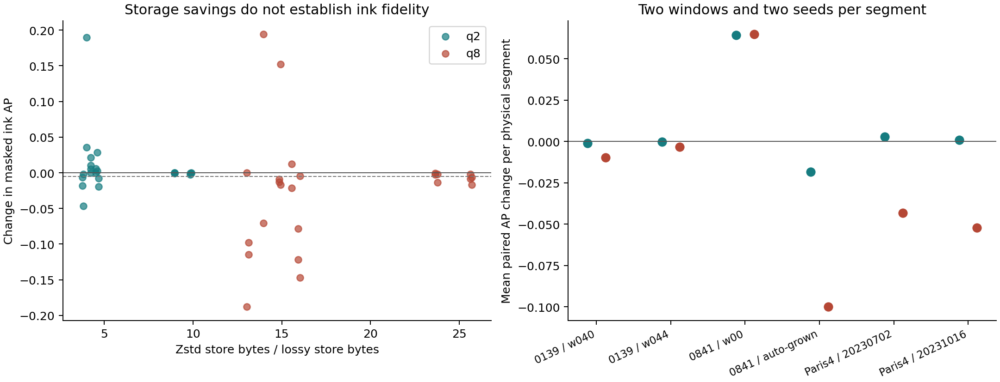

# Vesuvius Ink Fidelity

A reproducible, task-aware compression benchmark for Vesuvius ink recovery. It reuses the released ink models and [volcomp](https://github.com/SuperOptimizer/volume-compressor), and measures their interaction through standard Zarr, surface rendering and depth pooling.

**Result: a seemingly reasonable lossy setting is not an ink-fidelity guarantee.** On 12 frozen windows from six segments across three scrolls, q8 model-input compression reduced masked ink average precision by up to **0.188**. Even q2 failed our preregistered operating gate. The deliverable is a tested evaluator, real-data evidence and a conservative decision procedure, not a new codec or a claim of newly recovered letters.

See [the full results](reports/RESULTS.md), [numerical table](reports/scores.csv), [preregistration](experiments/TEST_PROTOCOL.md), [research log](research/LOG.md), and [prior-art investigation](research/ECOSYSTEM_AND_OPPORTUNITIES.md).

This review branch adds [copied-label cache integrity](reports/LABEL_CACHE_INTEGRITY.md): refresh previously skipped existing shards, allowing valid-but-changed labels or truncated copies to survive. Mismatches are now restored atomically from verified source bytes. Actual PHerc0139 data and interruption/retry tests validate the repair; no original scores or labels are changed.

The reviewed release is [v0.2.0](https://github.com/pdmacinnes/vesuvius-ink-fidelity/releases/tag/v0.2.0). A fresh native Windows environment reproduced all24 short-command verification records exactly. The release also contains [exploratory mechanism probes](reports/MECHANISMS.md): both padding candidates failed selection, and raw-reference normalization did not repair the largest losses. Patrick reviewed these diagnostics in PR #3. They retain their experimental status and do not change the original/lossless recommendation.



## What the experiment established

- Fixed final ink_9um seed42/43 weights; official model, normalization, patch grid and Hann blending; FP32 with TF32 disabled.
- Raw and lossless Zstd controls produced identical predictions. Repeated raw inference was exact in the development pilot.
- q2 model-input stores were 3.76-9.90x smaller than native lossless Zstd stores, including actual codec storage and metadata. This did **not** satisfy the ink error budget.
- q8 had material failures on four segments across PHercParis4 and PHerc0841. The two strongest cross-scroll failures were reproduced from a separate empty cache: all 24 corresponding arm predictions, decoded inputs and metrics matched exactly.
- Compression before versus after depth pooling behaves differently. Neither the pooled-input experiments nor the bounded native9 CT rendering experiment certify the entire compressed CT mirror.

Scroll masks are human/pseudo-label evidence, not independent infrared ground truth. Some evaluated segments were in model training. “Frozen test” means untouched by this project's development selection, not that all regions were unseen by the released models. These are paired input-sensitivity measurements; AP/F1 are not readability scores.

## Windows setup

Run from this repository's root. Requires Python 3.12, Git, PowerShell and an NVIDIA GPU/driver compatible with CUDA 12.8. Validated on an RTX 5070 Ti, 16 GB VRAM, driver 581.57. The code loads a validated subset of pinned Villa sources; it does not install the full upstream package, which declares a newer runtime.

```powershell
.\scripts\setup-windows.ps1 -Python 'C:\path\to\python.exe'
```

The script creates `.venv`, installs pinned analysis/model dependencies, acquires sparse upstream sources, builds the existing codec using portable LLVM-mingw and downloads two checksum-pinned released models. Everything stays in this folder. No WSL, Docker, paid compute or system compiler installation is required. Upstream binaries, weights and CT/label/mesh assets are excluded from Git.

GPU dependencies are substantial, particularly the roughly2.8 GB PyTorch wheel. Data acquisition is bounded to required ROIs. The cold-cache two-window reproduction acquired about 54.6 MiB of source objects; the full experiment uses more. See [third-party and data terms](THIRD_PARTY.md) before using or redistributing source assets.

## Run

The supplied frozen manifest already names exact test windows. Recreating it is optional and requires a fresh catalog; do not regenerate it after seeing scores and describe the result as preregistered.

The shortest GPU reproduction starts directly from the published reference records. It does not require running the full 128-record benchmark first:

```powershell
.venv\Scripts\ink-fidelity.exe reproduce
```

This acquires a bounded source subset in a separate cache and verifies the strongest failures on two different scrolls against the included results and source hashes. It is a reproduction of reported cases, not new held-out validation.

```powershell
# CT-only raw rendering parity, fetching the matching public mesh
.venv\Scripts\ink-fidelity.exe pilot --render-only

# Two development windows, fixed settings
.venv\Scripts\ink-fidelity.exe pilot --seed 42
.venv\Scripts\ink-fidelity.exe pilot --seed 43

# Frozen 12-window benchmark and actual encoded store sizes
.venv\Scripts\ink-fidelity.exe benchmark
.venv\Scripts\ink-fidelity.exe report
.venv\Scripts\ink-fidelity.exe quality

# Original CT chunks -> TIFXYZ render -> ink model; development evidence
.venv\Scripts\ink-fidelity.exe ct

# Separate-cache reproduction, enforcing published source hashes
.venv\Scripts\ink-fidelity.exe reproduce --receipts reports/source-receipts.json
```

Completed benchmark arms resume only when manifest/input/model identity and the probability-file checksum match. Partial or corrupted outputs do not count as complete. The report refuses an incomplete set. Cached source receipts can be enforced with `benchmark --receipts reports/source-receipts.json`; change `--cache` to use a different source cache.

For a quicker first check, use the pilot before the full benchmark. Logs and numerical artifacts live in `artifacts/`, and inputs in `.cache/`/`data/`, all Git-ignored.

## Formats and API

- Original CT and surface chunks: 3D numeric Zarr v2 arrays, original global chunk coordinates, explicit levels and checked chunk sizes. The ink_9um render experiment requires uint8 CT; uint16 is not silently rescaled.
- Labels: actual standard Zarr v3 arrays with compressed shards; explicit supervision masks. Local generic `open_array` also accepts v2/v3 arrays and OME-Zarr groups with a named level. Arbitrary remote v3 CT codecs are not claimed as tested by the bounded raw-chunk path.
- Geometry: standard TIFXYZ directories, including upstream optional-mask/validity semantics. Geometry helpers are imported from pinned Villa rather than reimplemented.
- Outputs: ordinary Zarr model inputs, actual volcomp Zarr v3 encoded stores, TIFF predictions, float arrays, JSON, CSV and static PNG figures. Physical/source identities remain in manifests.

```python
from pathlib import Path
from ink_fidelity.metrics import ink_metrics
from ink_fidelity.acquisition import open_array

image = open_array(Path("input.ome.zarr"), level="0")
scores = ink_metrics(labels, probabilities, supervision_mask, threshold=0.5)
```

`InkModel`, `Codec`, `render_surface` and `benchmark` expose small Python interfaces. Run experimental CLIs from the repository root so pinned sources and local models are resolved consistently. The implementation is intentionally a research package rather than a hosted service.

The release wheel contains the Python code. Commands still require the repository's manifests/reference reports and separately acquired upstream sources, native codec and models. Use the Windows setup from a checkout for the supported end-to-end path; the wheel alone is not a bundled dataset/model application.

## Tests

```powershell
$scratch = Join-Path '.cache' ('pytest-' + [guid]::NewGuid().ToString('N'))
.venv\Scripts\python.exe -m pytest -q --basetemp $scratch -p no:cacheprovider
.venv\Scripts\ruff.exe check src tests
```

Tests cover known-answer/tied rankings, supervision, undefined scores, grouping, Zarr v2/v3 levels, malformed chunk sizes, lossless padding, frame mismatch, safe output identities, corruption, interrupted acquisition and official pooling conventions. Codec/upstream integration tests require the separately built sources. See the results report for real-GPU and upstream-test evidence.

## Decision and limitations

The current conservative choice for evidence-sensitive ink inference is original or byte-exact lossless input until a setting passes validation on the intended representation/domain. This benchmark rejects the proposed universal q2 recommendation. Its positive overall mean does not erase adverse cases or the failed confidence/F1 thresholds.

No new text or First Letters discovery is claimed. Compression-induced shapes and foreground gains cannot establish recovered letters. Potential new discoveries must remain private for the organizers' technical/papyrological review.

Code: MIT. The codec, models and existing validation/registration work are credited in [THIRD_PARTY.md](THIRD_PARTY.md) and the research report. Do not attribute their prior contributions to this package.
