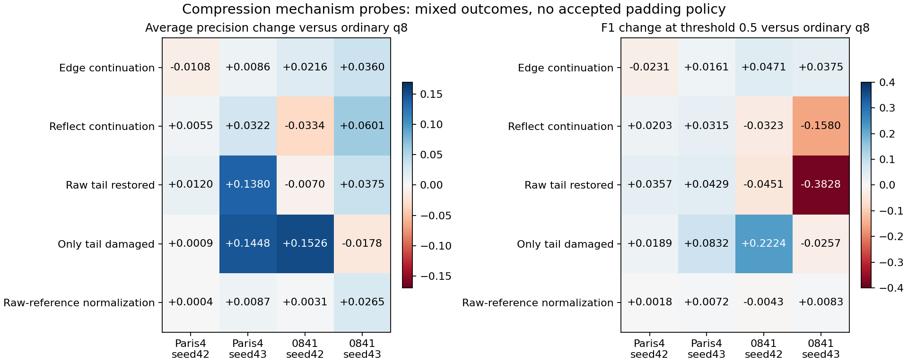

# Compression mechanism probes - October 6, 2026

**No padding policy passed the prewritten selection rule.** Raw-reference normalization did not repair the largest failures. These negative results support retaining original/lossless input, rather than adding an experimental writer to the stable release.

This is post-test exploratory evidence. The two regions were selected as the worst published q8 case in each of PHercParis4 and PHerc0841. They are not fresh validation. All four region/seed cells and all arms are reported; no threshold was retuned after scoring.



## Hypothesis and prior work

The existing [volcomp codec](https://github.com/SuperOptimizer/volume-compressor/tree/20b03983ee741baa160d3e630da77a3b3a24ee44) uses independent16³ transforms inside128³ chunks. Our21-plane model-input stack occupies only five planes of its last depth transform block. The question was whether continuing those boundary values, instead of introducing zeros, would repair the observed ink losses. The codec and its existing sensitivity warnings are upstream contributions.

Padding variants continue only to the next16-voxel boundary and retain zero fill beyond it. The declared Zarr shape remains unchanged and the standard volcomp reader reproduces every decoded voxel. [Zarr recommends fill values outside array bounds](https://zarr-specs.readthedocs.io/en/latest/v3/core/index.html); continuation explicitly deviates from that recommendation and remains an experimental encoder choice. Decoder compatibility alone is not evidence that a policy is desirable.

Protocols were written before their respective inference runs: [padding](../experiments/PADDING_PROTOCOL.md), [normalization](../experiments/NORMALIZATION_PROTOCOL.md). The original frozen benchmark, manifests and numerical conclusions are unchanged.

## Padding results

Masked average precision, rounded for display:

| Arm | Paris4 seed42 | Paris4 seed43 | 0841 seed42 | 0841 seed43 |
|---|---:|---:|---:|---:|
| Original raw | .9728 | .9732 | .6826 | .6876 |
| Ordinary zero-q8 | .9685 | .8263 | .4949 | .6877 |
| Edge continuation | .9576 | .8348 | .5165 | .7237 |
| Reflect continuation | .9740 | .8584 | .4614 | .7478 |
| q8 with raw tail restored | .9805 | .9642 | .4879 | .7252 |
| Raw with only q8 tail substituted | .9694 | .9711 | .6474 | .6699 |

The selection rule required a positive mean AP change versus ordinary q8 and no cell harmed by more than0.01. Edge mean change was +0.013832, but its worst change was -0.010842. Reflect mean was +0.016078, but its worst change was -0.033430. **Both fail.** No policy was selected and no fresh-region confirmation was run. Changing the threshold to rescue a candidate would violate the protocol.

Real voxels are unchanged before encoding; all policies pass q=0 and Zstd exact controls. Decoded first16-plane blocks remain bit-identical across padding policies. Actual full-store bytes were:

| Region | Ordinary zero-q8 | Edge | Reflect |
|---|---:|---:|---:|
| Paris4 | 277,410 | 286,754 | 346,735 |
| 0841 | 384,415 | 411,164 | 487,539 |

Restoring the tail recovers much of the Paris4 seed43 AP loss, but fails to repair the 0841 seed42 loss. The interventions therefore reject a universal boundary-only explanation. They also expose metric disagreement: for 0841 seed43, tail restoration improves AP from .6877 to .7252 while F1 at the unchanged0.5 threshold falls from .3878 to .0050. Reflect improves that cell's AP to .7478 while F1 falls to .2298. A ranking gain does not establish thresholded ink preservation.

## Normalization counterfactual

The diagnostic anchors each patch to the official raw normalization, clips raw and decoded values to identical raw1st/99th percentile bounds, and adds their difference in the recovered raw affine scale. It also preserves raw occupancy. This requires original raw input and is not a proposed deployment method. The recovered effective scale is an approximation; exact raw prediction controls establish baseline parity, not independence of every interacting effect.

| Raw-reference normalized q8 | Paris4 seed42 | Paris4 seed43 | 0841 seed42 | 0841 seed43 |
|---|---:|---:|---:|---:|
| Average precision | .9689 | .8350 | .4980 | .7142 |
| AP gain versus ordinary q8 | +.0004 | +.0087 | +.0031 | +.0265 |
| F1 at0.5 | .8903 | .8322 | .1363 | .3961 |

The mean AP improvement is +0.009668 over four deliberately selected development cells. It is not a generalization estimate. The largest losses remain: 0841 seed42 rises only from .4949 to .4980, against raw .6826; Paris4 seed43 rises from .8263 to .8350, against raw .9732. F1 worsens slightly for 0841 seed42. Normalization alone is not an adequate explanation or repair.

## Controls, repetition and reproduction

The final guarded implementation was run again using the default inputs produced by the public `reproduce` command. All24 padding scores/decoded arrays and all16 normalization scores/probability hashes matched the first runs exactly. Raw and ordinary q8 probability files match the published controls; frozen-raw normalization predictions are bit-identical to the official raw path. Both released seeds use the original FP32/TF32-off contract. The scoped dataset wrapper restores upstream state even when inference fails.

From a prepared repository root:

```powershell
.venv\Scripts\ink-fidelity.exe reproduce
.venv\Scripts\ink-fidelity.exe padding-study
.venv\Scripts\ink-fidelity.exe normalization-study
```

The study commands require the acquired reproduction inputs. They retain all raw/decoded arrays and predictions under Git-ignored `artifacts/`. Controls fail explicitly on hash mismatches. Public outputs contain numerical records only: [padding records](padding-records.json), [normalization records and parameter receipts](normalization-records.json), [AP/F1 table](mechanism-scores.csv), [selection verdict and artifact hashes](mechanism-summary.json).

Package verification:34 tests passed, including lossless/partial-block checks, affine-counterfactual edge cases and wrapper restoration after failure; lint passed. Native codec tests execute locally, while environments without the compiled codec explicitly skip those integration cases.

These are sensitivity diagnostics against available supervision, not physical ink truth, recovered letterforms or independent community reproduction. No improved compression policy is promoted. The scientifically useful result is that two plausible simple repairs fail in different ways, and AP alone can conceal severe fixed-threshold damage.
